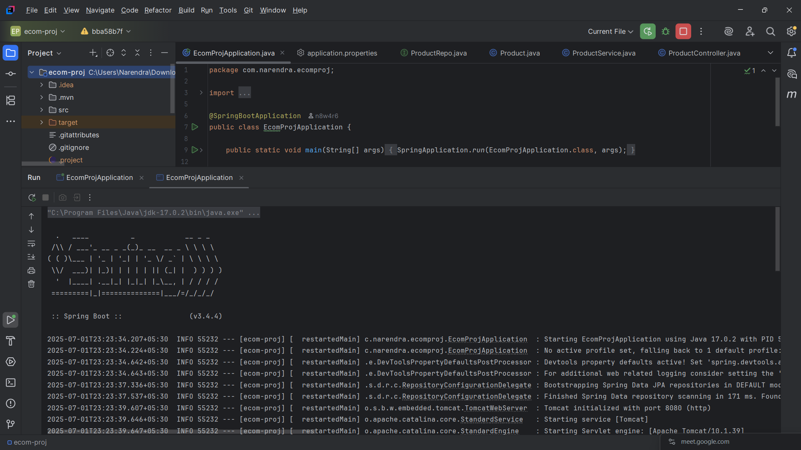
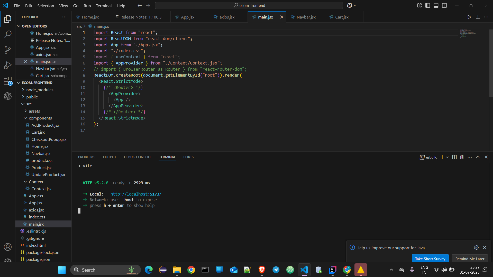
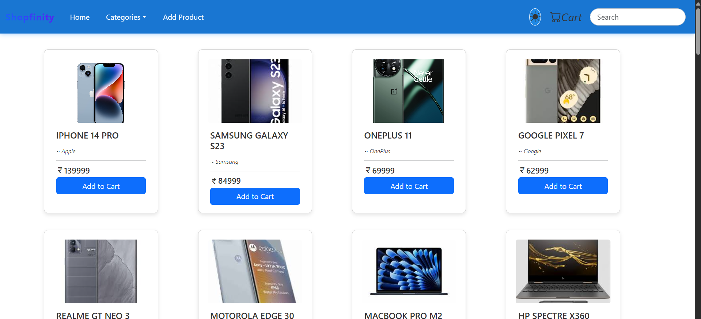
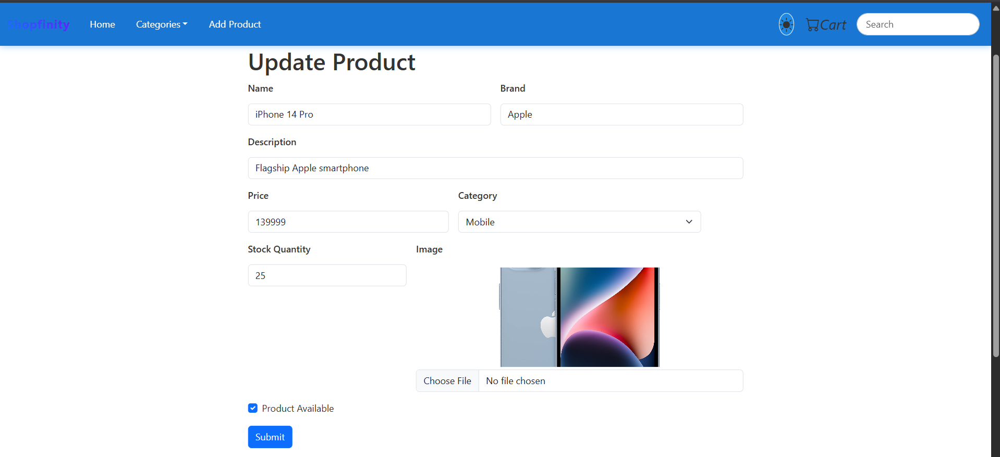
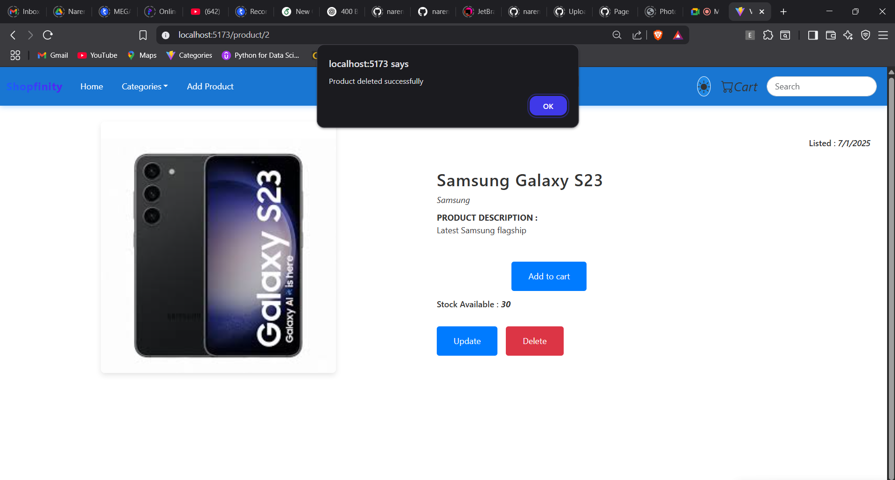
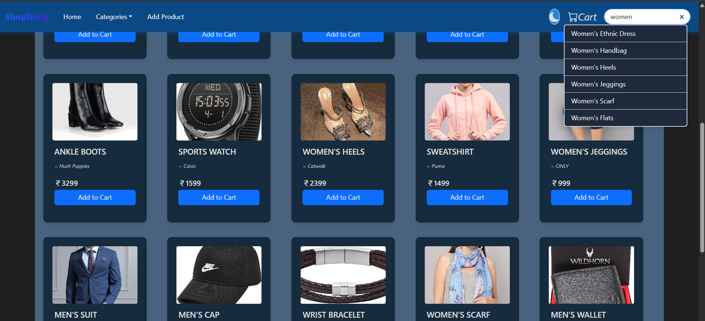
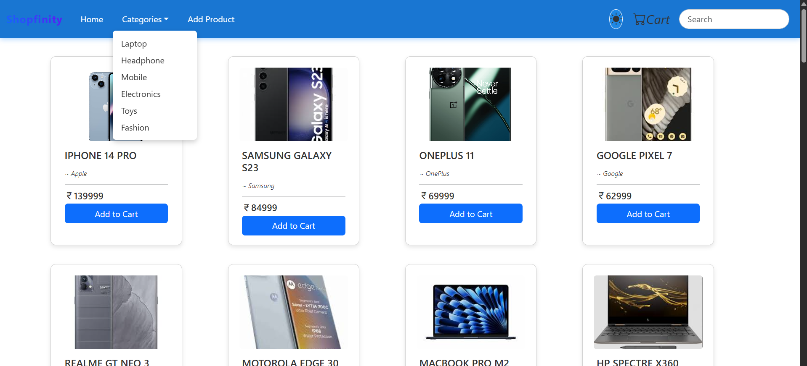

# 🛒 Shopifinity – E-Commerce Spring Boot App

A Spring Boot-based **E-Commerce Web Application** that supports product listing, category filtering, cart functionality, and basic CRUD operations for managing products.

---

## 🚀 Features

- 🌐 RESTful API using Spring Boot
- 🛍️ Product catalog with detailed view
- 🛒 Add to cart functionality
- 🔍 Search and filter by category
- 🧾 Admin product management (add/update/delete)
- 🖥️ Frontend-backend server integration

---

## 🏗️ Tech Stack

- Java 17+
- Spring Boot 3+
- Spring Data JPA
- MySQL / H2 Database
- React / HTML-CSS-JS (Frontend)
- Maven

---

## 📸 Screenshots & Workflow

This section explains the functionality of the Shopifinity app using actual screenshots from development and testing.

---

### ✅ 1. Backend Server Running

The Spring Boot application is up and running on port `8080`, indicating that the backend is initialized and ready to serve API requests.

---

### 🌐 2. Frontend Server Running

The frontend development server is successfully running (typically on `localhost:3000`) and ready to communicate with the Spring Boot backend.

---

### 🏠 3. Home Page – Product Showcase

The homepage displays a list of available products with image, name, price, and a button to view details or add to cart.

---

### ➕ 4. Add New Product (Admin)

Admins can add new products via a form interface. This feature includes fields like name, price, description, and category.

---

### 📝 5. Update Product (Admin)

Admins can update product details such as name, price, and description from this form view.

---

### ❌ 6. Delete Product (Admin)

The admin panel allows deletion of a product with a confirmation prompt to prevent accidental removal.

---

### 🔍 7. Search Products

Users can search products by keywords like name or category. The UI dynamically filters the displayed product list.

---

### 🛒 8. Cart Page

Displays all products added to the cart along with quantity, total price, and an option to remove items.

---

### 📂 9. Categories Page

Users can view and filter products by category. Each category section displays the respective filtered products.

---

### 📦 10. Product Details

Detailed view of a selected product showing its full description, image, price, and an "Add to Cart" option.

---

## 🙋‍♂️ Author

**Narendra Nambula**  
[GitHub](https://github.com/your-username) | [LinkedIn](https://linkedin.com/in/your-profile)

---
